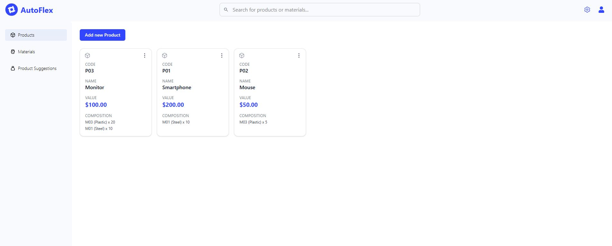

# AutoFlex
Aplicação web para gerenciar produtos, matérias-primas e determinal o plano de produção ideal baseado no estoque disponível.



## 💻 Tech-stack
Backend
- Java
- Spring-Boot

Frontend
- Typescript
- React

Database
- Oracle

## 💻 Pré-requisitos
Antes de começar, verifique se você atendeu aos seguintes requisitos:

- Você instalou a versão mais recente de Docker Desktop
- Você tem Git instalado.

## 🚀 Rodando Localmente
Primeiro clone o repositório em um diretório escolhido.
```
git clone https://github.com/joaovfarias/Autoflex-Projedata.git
cd Autoflex-Projedata
```
Na raiz do diretório execute:
```
docker compose up --build -d
```
Espere alguns minutos e a aplicação estará rodando!

## Como Acessar
Frontend
```
http://localhost:5173
```
Documentação da API
```
http://localhost:8080/swagger-ui/index.html#/
```


## Testes
Para rodar os testes unitários desenvolvidos:
```
cd backend
mvn test
```
